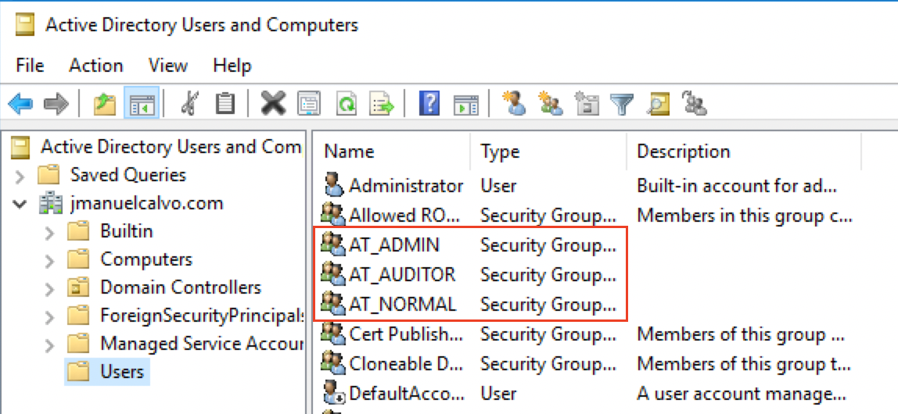

# Configuracion de Ansible Tower contra Active Directory

Para este ejercicio se realiza la configuracion de un Directorio Activo que contiene usuarios y grupos sobre la carpeta Users y se crean 3 grupos 
  - AT_ADMIN
  - AT_AUDITOR
  - AT_NORMAL




Desde una de las maquinas de Ansible Tower se valida la conectividad con el siguiente comando:
```
[root@localhost ~]# ldapsearch -x -LLL -h 10.42.0.50 -b dc=jmanuelcalvo,dc=com -D jmanuel@jmanuelcalvo.com -W 
```

Una vez se garantice la conectividad se procede a realizar la configuracion en Ansible Tower

## Parametros de Configuracion de Ansible Tower con Active Directory


Los siguientes parametros van a definir el comportamiento de la autenticacion

### LDAP USER SEARCH
```bash
[
 "DC=jmanuelcalvo,DC=com",
 "SCOPE_SUBTREE",
 "(sAMAccountName=%(user)s)"
]
```


### LDAP GROUP SEARCH
```
[
 "CN=Users,DC=jmanuelcalvo,DC=com",
 "SCOPE_SUBTREE",
 "(objectClass=group)"
]
```

### LDAP USER ATTRIBUTE MAP
```
{
 "first_name": "givenName",
 "last_name": "sn",
 "email": "userPrincipalName"
}
```

### LDAP GROUP TYPE PARAMETER
```
{}
```

### LDAP USER FLAG BY GROUP
Define el grupo de los usuarios que seran administradores en Ansible Tower
```
{
 "is_superuser": [
  "CN=AT_ADMIN,CN=Users,DC=jmanuelcalvo,DC=com"
 ]
}
```

### LDAP ORGANIZATION MAP
En este caso la organizacion en Ansible Tower es `Red Hat`


```
{
 "Red Hat": {
  "users": [
   "CN=AT_AUDITOR,CN=Users,DC=jmanuelcalvo,DC=com",
   "CN=AT_USER,CN=Users,DC=jmanuelcalvo,DC=com"
  ],
  "admins": "CN=AT_ADMIN,CN=Users,DC=jmanuelcalvo,DC=com",
  "remove_admins": true
 }
}
```
