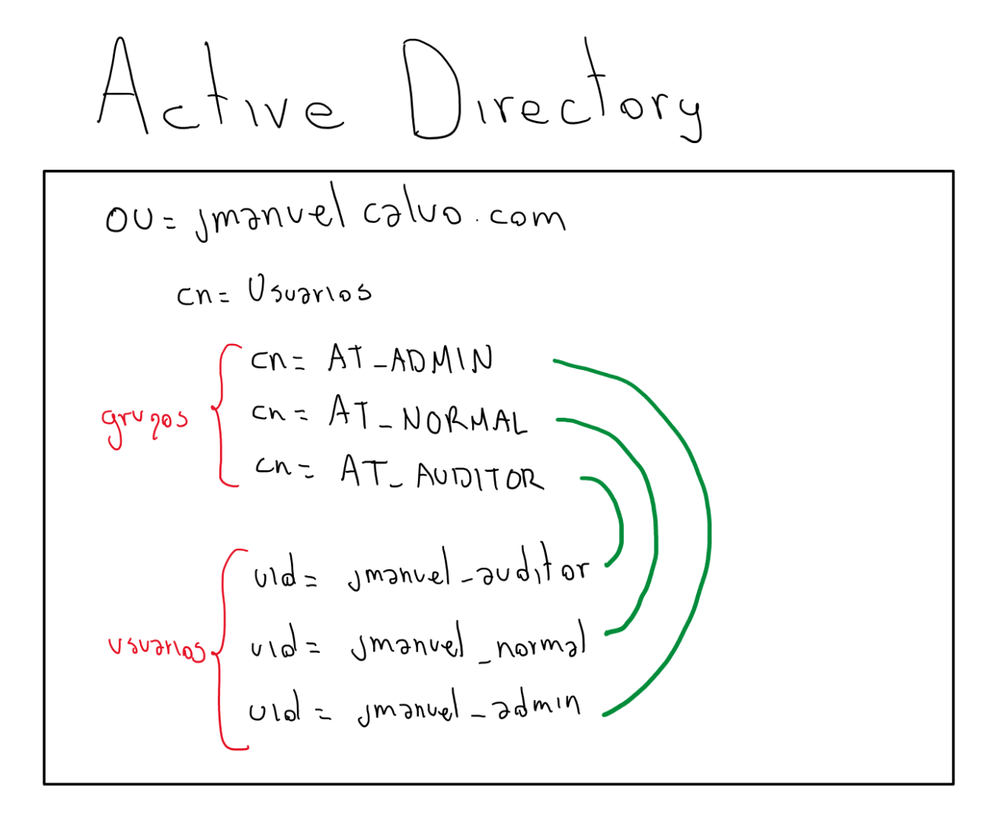
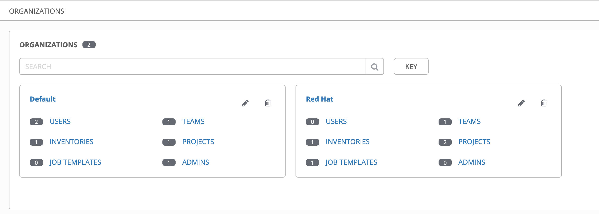
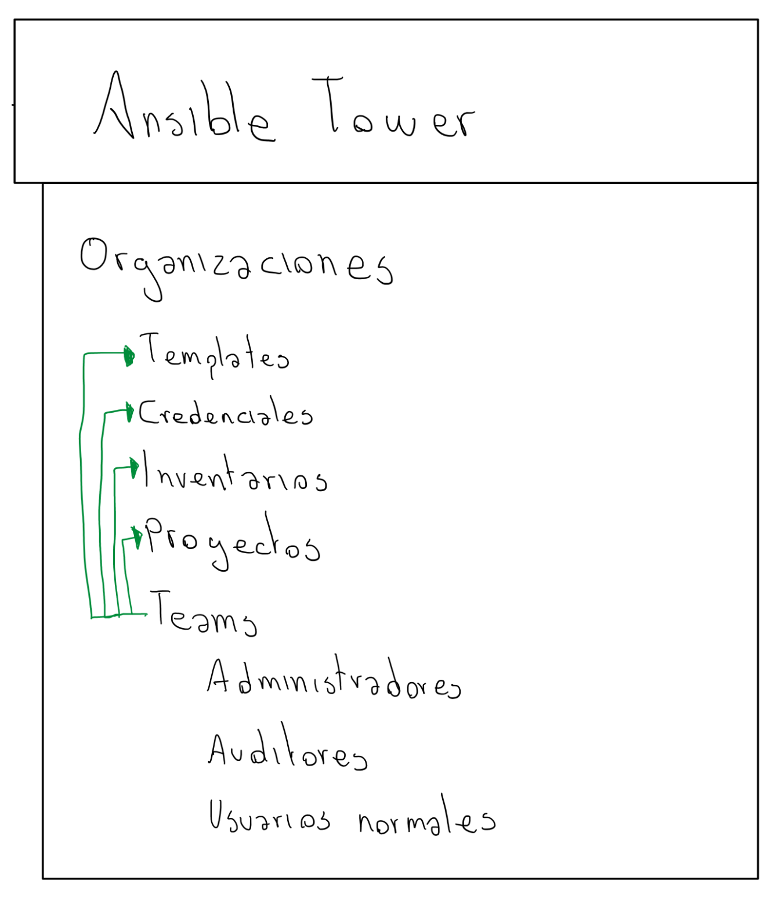
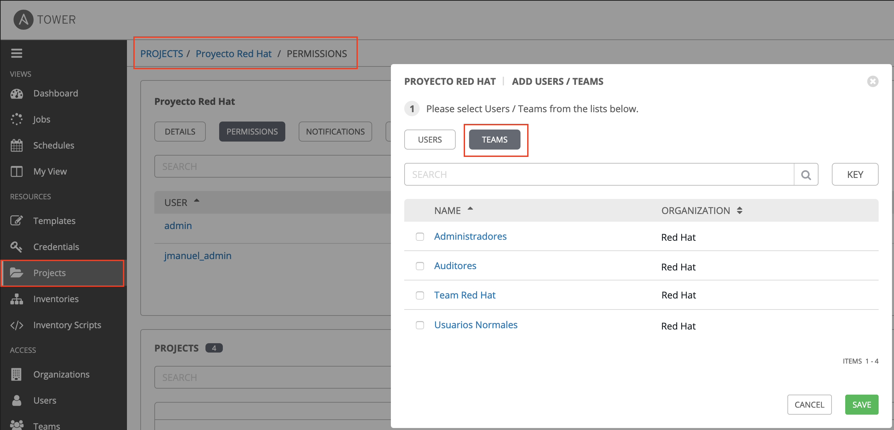

# Configuracion de Ansible Tower contra Active Directory

Para este ejercicio se realiza la configuracion de un Directorio Activo que contiene usuarios y grupos sobre la carpeta Users y se crean 3 grupos 
  - AT_ADMIN
  - AT_AUDITOR
  - AT_NORMAL


y se crean 3 usuarios de prueba, cada usuario perteneces a un grupo 
  - jmanuel_admin
  - jmanuel_auditor
  - jmanuel_normal




Desde una de las maquinas de Ansible Tower se valida la conectividad con el siguiente comando:
```
[root@localhost ~]# ldapsearch -x -LLL -h 10.42.0.50 -b dc=jmanuelcalvo,dc=com -D jmanuel@jmanuelcalvo.com -W 
```

> **Nota**
>
> Si no cuenta con el cliente ldapsearch instale el paquete openldap-clientes

Una vez se garantice la conectividad se procede a realizar la configuracion en Ansible Tower

## Parametros de Configuracion de Ansible Tower con Active Directory


Los siguientes parametros van a definir el comportamiento de la autenticacion

### LDAP USER SEARCH
```bash
[
 "DC=jmanuelcalvo,DC=com",
 "SCOPE_SUBTREE",
 "(sAMAccountName=%(user)s)"
]
```
> **NOTA**
>
> Para múltiples consultas de búsqueda, la sintaxis adecuada es:

```
[
  [
  "OU=Users,DC=northamerica,DC=acme,DC=com",
  "SCOPE_SUBTREE",
  "(sAMAccountName=%(user)s)"
  ],
  [
  "OU=Users,DC=apac,DC=corp,DC=com",
  "SCOPE_SUBTREE",
  "(sAMAccountName=%(user)s)"
  ],
  [
  "OU=Users,DC=emea,DC=corp,DC=com",
  "SCOPE_SUBTREE",
  "(sAMAccountName=%(user)s)"
  ]
]
```


### LDAP GROUP SEARCH
```
[
 "CN=Users,DC=jmanuelcalvo,DC=com",
 "SCOPE_SUBTREE",
 "(objectClass=group)"
]
```

### LDAP USER ATTRIBUTE MAP
```
{
 "first_name": "givenName",
 "last_name": "sn",
 "email": "userPrincipalName"
}
```

### LDAP GROUP TYPE PARAMETER
```
{}
```

### LDAP USER FLAG BY GROUP
Define el grupo de los usuarios que seran administradores en Ansible Tower
```
{
 "is_superuser": [
  "CN=AT_ADMIN,CN=Users,DC=jmanuelcalvo,DC=com"
 ]
}
```

### LDAP ORGANIZATION MAP
En este caso la organizacion en Ansible Tower es `Red Hat`



```
{
 "Red Hat": {
  "users": [
   "CN=AT_AUDITOR,CN=Users,DC=jmanuelcalvo,DC=com",
   "CN=AT_NORMAL,CN=Users,DC=jmanuelcalvo,DC=com"
  ],
  "admins": "CN=AT_ADMIN,CN=Users,DC=jmanuelcalvo,DC=com",
  "remove_admins": true
 }
}
```

### LDAP TEAM MAP

```
{
 "Auditores": {
  "users": "CN=AT_AUDITOR,CN=Users,DC=jmanuelcalvo,DC=com",
  "remove": true,
  "organization": "Red Hat"
 },
 "Usuarios Normales": {
  "users": "CN=AT_NORMAL,CN=Users,DC=jmanuelcalvo,DC=com",
  "remove": true,
  "organization": "Red Hat"
 },
 "Administradores": {
  "users": "CN=AT_ADMIN,CN=Users,DC=jmanuelcalvo,DC=com",
  "remove": true,
  "organization": "Red Hat"
 }
}
```

Una vez configurados los Teams, se puede empezar a permitir/denegar los accesos para los diferentes recursos dentro de Ansible Tower a los diferentes Teams



De la siguiente forma:


> ** Informacion adicional **
>
> https://docs.ansible.com/ansible-tower/latest/html/administration/ldap_auth.html
