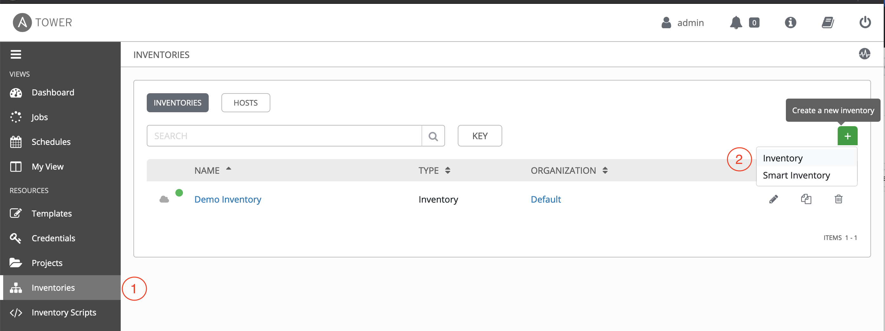
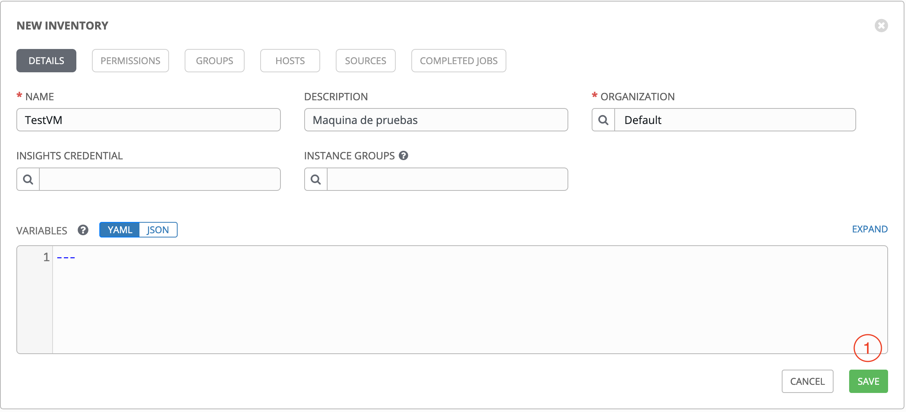
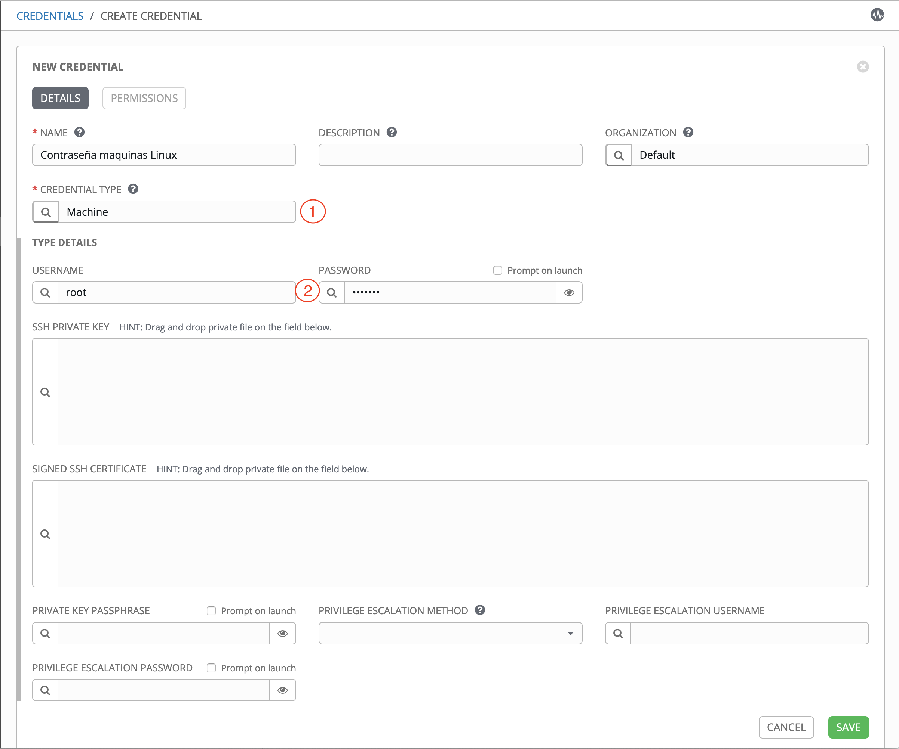
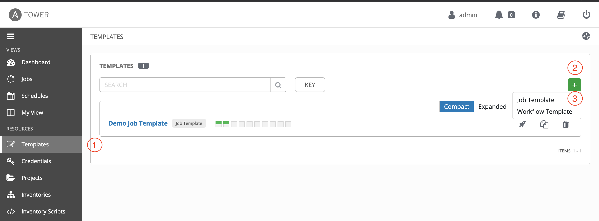
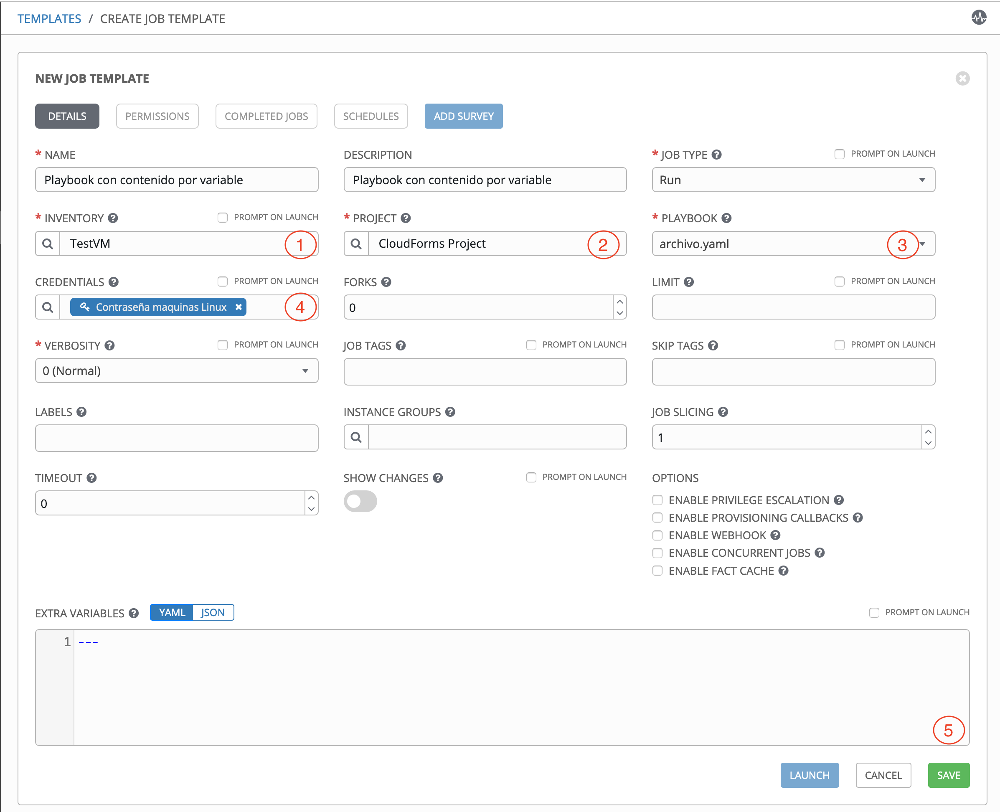

Una vez integrados el proveedor Ansible Tower en CloudForms se pueden crear catalogos que hagan el llamado a playbooks y ademas pasarle parametros desde Cloudforms asi:

### 1. Crear proyecto Ansible Tower
Resources -> Projects -> +


En caso de no tener repositorio git para el Ansible Tower, crear una carpeta local para almacenar los playbooks
```
[root@tower36 ~]# mkdir /var/lib/awx/projects/cloudforms
[root@tower36 ~]# chown awx:awx /var/lib/awx/projects/cloudforms/
```

Una vez creada la carpeta, ya se debe visualizar a traves de la interfase de tower, ahi se debe seleccionar el SCM TYPE: Manual    La subcarpeta local del hosts de ansible tower y la carpeta creada en el paso anterior


### 2. Crear un playbook en Ansible, que soporte la inyeccion de variables
Las variables que se ponen en este playbook basico, posteriormente seran enviadas a traves de un catalogo de CloudForms

```
[root@tower36 ~]# cat <<EOF > /var/lib/awx/projects/cloudforms/archivo.yaml
---
- hosts: all
  become: true
  tasks:
  - name: Crear un archivo de pruebas
    file:
      path: /tmp/jmanuel.conf
      state: touch

  - name: Adicionar linea desde variable
    lineinfile:
      path: /tmp/jmanuel.conf
      line:  "{{ line1 }}"
      create: yes
EOF
```

### 3. Crear un inventario de hosts de pruebas, en el Ansible Tower
Resources -> Inventories -> + -> Inventory



Rellenar los datos con la descripcion del Hosts y click en SAVE



Ir a la pestaña HOSTS y dar click en + 


Adicionar la IP o nombre de la VM


### 4. Almacenar las contraseñas de las VMs o crear credenciales

Resources -> Credentials -> + -> Inventory


En el tipo de credential, seleccionar Machine cuando se trata de una maquina con Linux, en cuanto al usuario y contraseña, se puede seleccionar conexion directa con el usuario root, o en las mejores practicas un usuario que tenga privilegios de SUDO



### 5. Crear una plantilla que se encargara de ejecutar el playbook

Dentro de Resources -> Templates -> + -> Job Template



Ahora se deben rellenar los campos realizados en los pasos anteriores, inventarios, proyecto, playbook, credenciales y click en SAVE



Como la idea es que el playbook reciba parametros, en este caso se debe adicionar sobre la pestaña SURVEY los siguiente


Los valores del playbook y del survey deben coincidir


