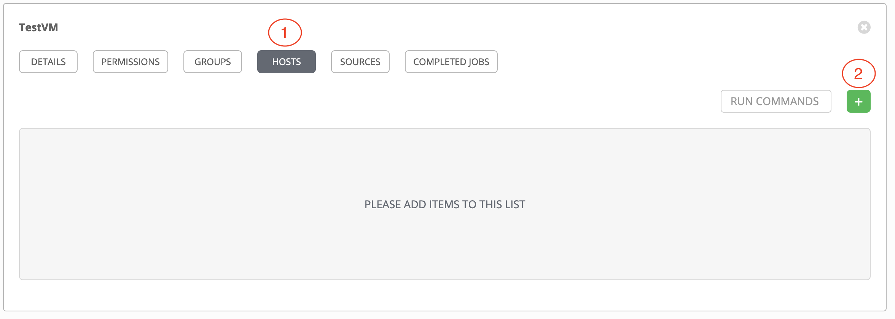

Una vez integrados el proveedor Ansible Tower en CloudForms se pueden crear catalogos que hagan el llamado a playbooks y ademas pasarle parametros desde Cloudforms asi:

# Crear proyecto y Template en Ansible Tower

1. En caso de no tener repositorio git para el Ansible Tower, crear una carpeta local para almacenar los playbooks
```
[root@tower36 ~]# mkdir /var/lib/awx/projects/cloudforms
[root@tower36 ~]# chown awx:awx /var/lib/awx/projects/cloudforms/
```

2. Crear el proyecto en Ansible Tower, que soporte la inyeccion de variables

```
[root@tower36 ~]# cat <<EOF > /var/lib/awx/projects/cloudforms/archivo.yaml
---
- hosts: all
  become: true
  tasks:
  - name: Crear un archivo de pruebas
    file:
      path: /tmp/jmanuel.conf
      state: touch

  - name: Adicionar linea desde variable
    lineinfile:
      path: /tmp/jmanuel.conf
      line:  "{{ line1 }}"
      create: yes
EOF
```

3. Crear un inventario de hosts de pruebas, en el Ansible Tower
Resources -> Inventories -> + -> Inventory


Rellenar los datos con la descripcion del Hosts y click en SAVE


Ir a la pestaña HOSTS y dar click en + 



Adicionar la IP o nombre de la VM


4. Almacenar las contraseñas de las VMs o crear credenciales

Resources -> Credentials -> + -> Inventory


En el tipo de credential, seleccionar Machine cuando se trata de una maquina con Linux, en cuanto al usuario y contraseña, se puede seleccionar conexion directa con el usuario root, o en las mejores practicas un usuario que tenga privilegios de SUDO


Crear un playbook que 


