# Integracion de playbooks en Ansible tower con Red Hat CloudFoms

Una vez integrados el proveedor Ansible Tower en CloudForms se pueden crear catalogos (un portal con un market place) que se encarguen de hacer el llamado a playbooks y ademas pasarle parametros desde formularios de Cloudforms.

Para esto, es necesario primero realizar la configuracion del Ansible Tower con por lo menos Un proyecto/playbook/Plantilla

## Pasos de configuracion de Ansible Tower

### 1. Crear proyecto Ansible Tower
Resources -> Projects -> +

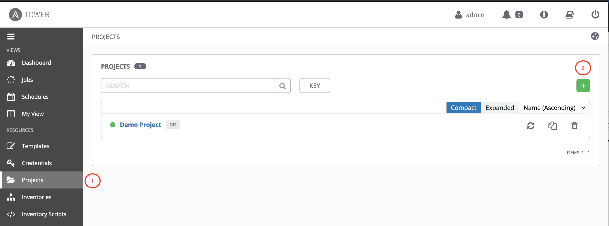

En caso de no tener repositorio git para el Ansible Tower, crear una carpeta local para almacenar los playbooks
```
[root@tower36 ~]# mkdir /var/lib/awx/projects/cloudforms
[root@tower36 ~]# chown awx:awx /var/lib/awx/projects/cloudforms/
```

Una vez creada la carpeta, ya se debe visualizar a traves de la interfase de tower, ahi se debe seleccionar el SCM TYPE: Manual    La subcarpeta local del hosts de ansible tower y la carpeta creada en el paso anterior


### 2. Crear un playbook en Ansible, que soporte la inyeccion de variables
Las variables que se ponen en este playbook basico, posteriormente seran enviadas a traves de un catalogo de CloudForms

```
[root@tower36 ~]# cat <<EOF > /var/lib/awx/projects/cloudforms/archivo.yaml
---
- hosts: all
  become: true
  tasks:
  - name: Crear un archivo de pruebas
    file:
      path: /tmp/jmanuel.conf
      state: touch

  - name: Adicionar linea desde variable
    lineinfile:
      path: /tmp/jmanuel.conf
      line:  "{{ line1 }}"
      create: yes
EOF
```

### 3. Crear un inventario de hosts de pruebas, en el Ansible Tower
Resources -> Inventories -> + -> Inventory


Rellenar los datos con la descripcion del Hosts y click en SAVE


Ir a la pestaña HOSTS y dar click en + 


Adicionar la IP o nombre de la VM

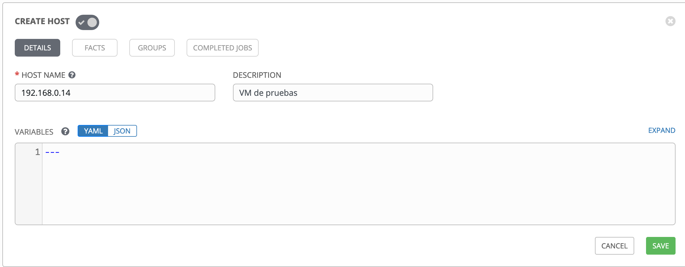

### 4. Almacenar las contraseñas de las VMs o crear credenciales

Resources -> Credentials -> + -> Inventory

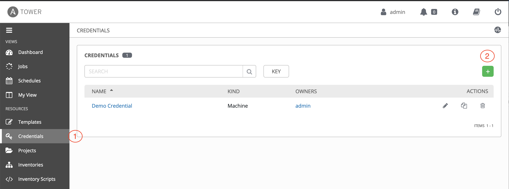

En el tipo de credential, seleccionar Machine cuando se trata de una maquina con Linux, en cuanto al usuario y contraseña, se puede seleccionar conexion directa con el usuario root, o en las mejores practicas un usuario que tenga privilegios de SUDO


### 5. Crear una plantilla que se encargara de ejecutar el playbook

Dentro de Resources -> Templates -> + -> Job Template


Ahora se deben rellenar los campos realizados en los pasos anteriores, inventarios, proyecto, playbook, credenciales y click en SAVE


Como la idea es que el playbook reciba parametros, en este caso se debe adicionar sobre la pestaña SURVEY los siguiente

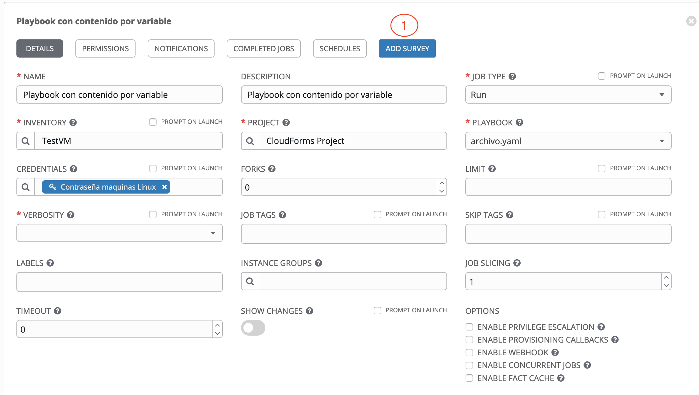

Los valores del playbook y del survey deben coincidir

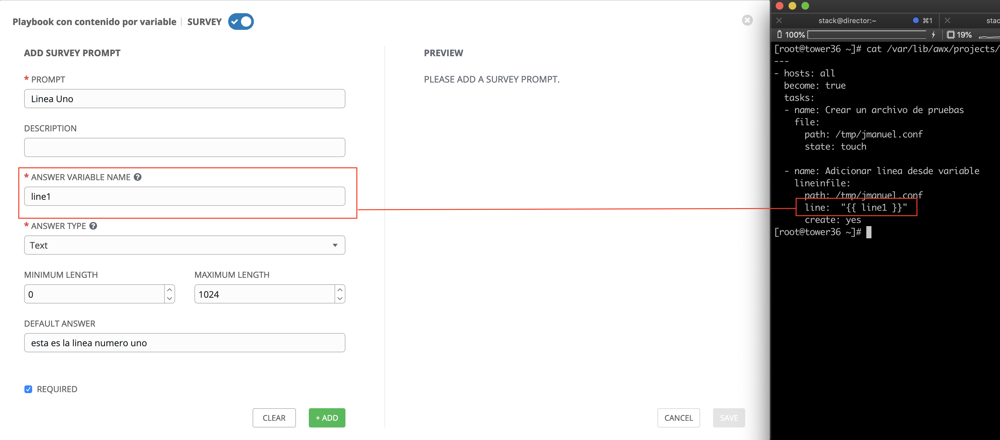


Una vez adicionado el campo, click en Save sobre el SURVEY y click en Save sobre el TEMPLATE

### 6. Validar que la plantilla funcione correctamente

Dentro de la Resources -> Templates -> Playbook con contenido por variable -> click en el cohete

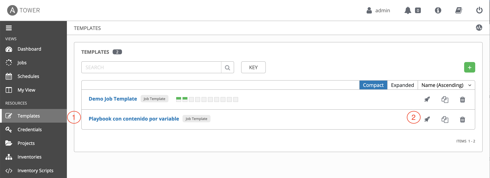

Rellenar los campos de los formularios NEXT -> LAUNCH

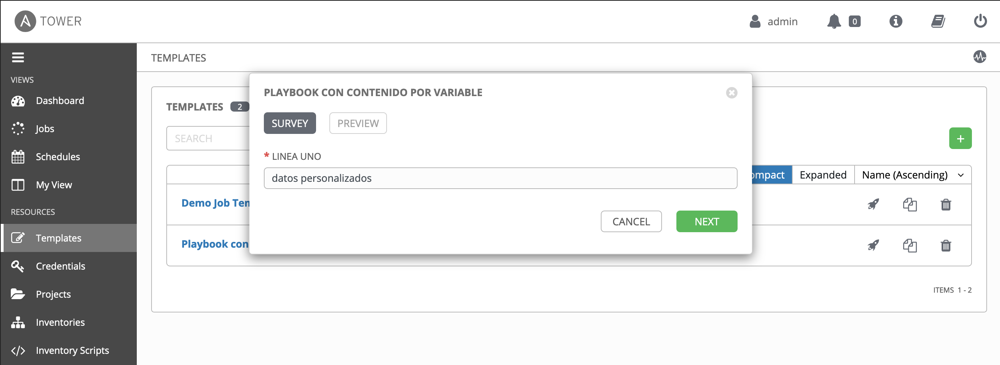

y Finalmente el playbook debe ejecutarse de forma satisfactoria

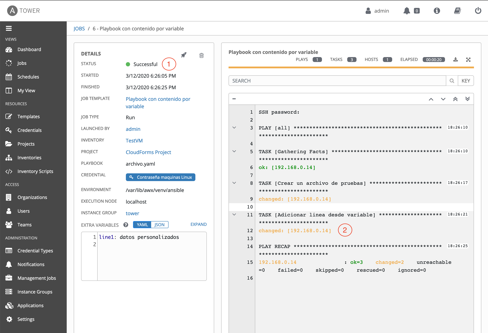


### 7. Validar la creacion del archivo y su contenido
```
[root@tower36 ~]# ssh 192.168.0.14
root@192.168.0.14's password:
cat[root@localhost ~]# cat /tmp/jmanuel.conf
datos personalizados
```


## Pasos de configuracion de CloudForms

### 1. Crear el formulario (Dialog)
Desde la interface web de administrador de Cloudforms, lo primero que se debe es generar el formulario que recibira el servicion, para ello se debe ir a Services -> Automate -> Customization

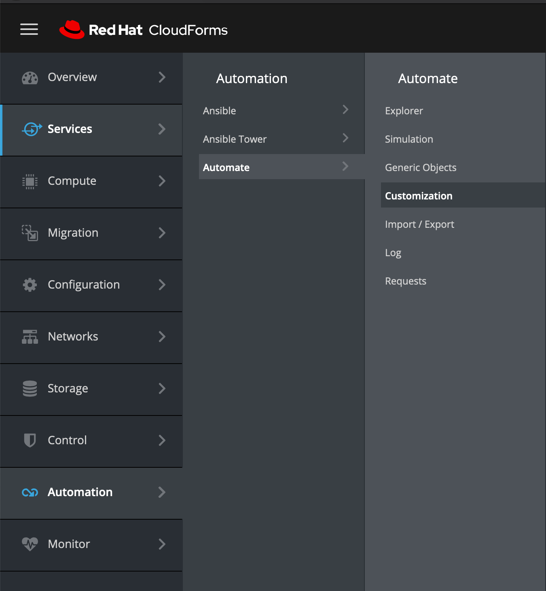

En el menu Service Dialogs -> All Dialogs

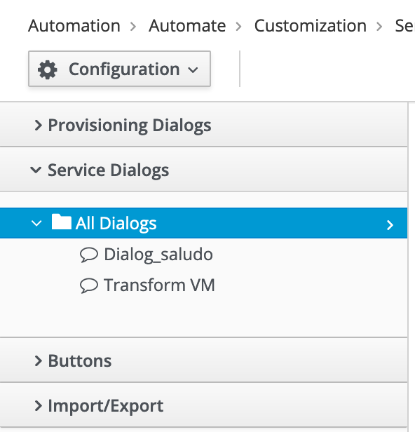

Configuration -> Add a new Dialog

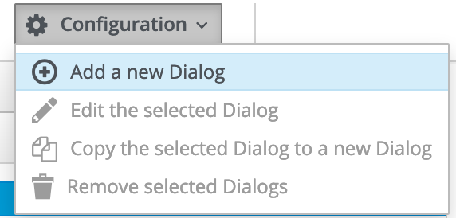

Se deben llegar los datos del formulario, tenga en cuenta que en paso 2, a mano derecha esta los posibles campos que se le pueden adicionar al formulario, botones, areas de texto, tags, entre otros, esos iconos se pueden arrastrar para realizar el diseño del formulario, una vez arrastrados, en el punto 3 se puede editar dicha casilla

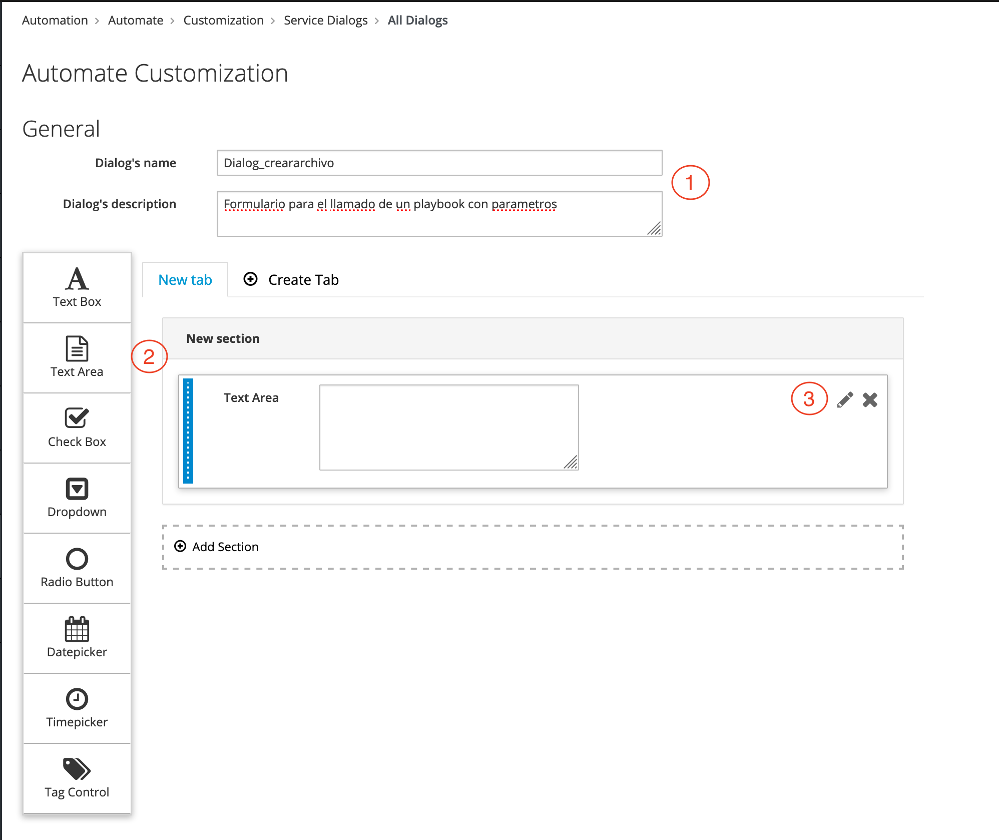

Y es justo aqui donde viene la magia de la integracion, ya que si en el playbook la variable que se le puede insertar se llama line1, entonces el campo del formulario del playbook este se debe llamar param_line1 asi:

Referencia: https://access.redhat.com/solutions/3887651


### 2. Crear el catalogo de servicios 

Lo siguiente ahora es crear el catalogo, para ello hay que ir al menu Services -> Catalogs 

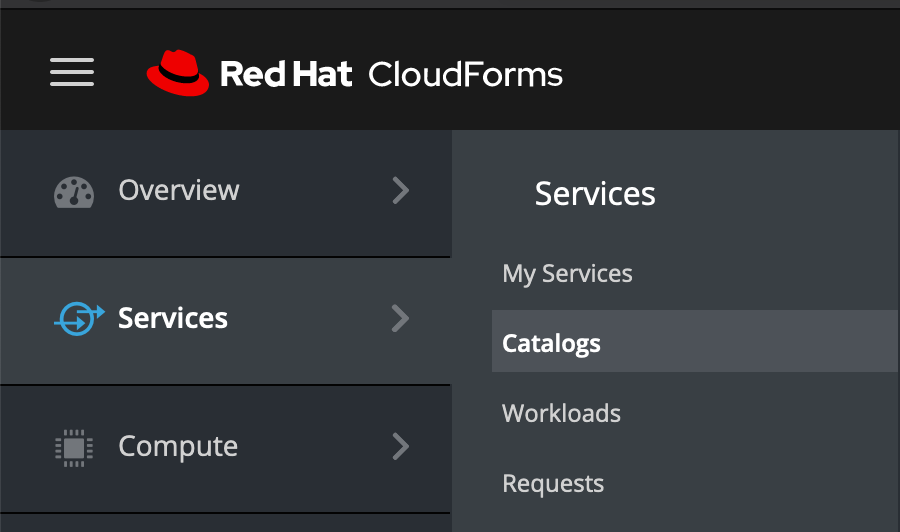

Ir al sub menu Catalog Items -> All Catalog Items

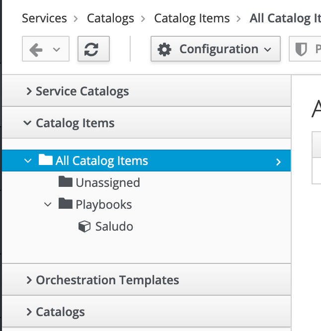

y en Configuration -> Add a New Catalog Item

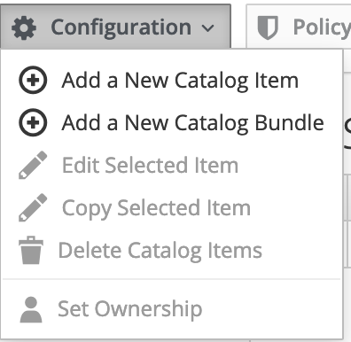

Seleccionar Catalog Item Type -> Ansible Tower

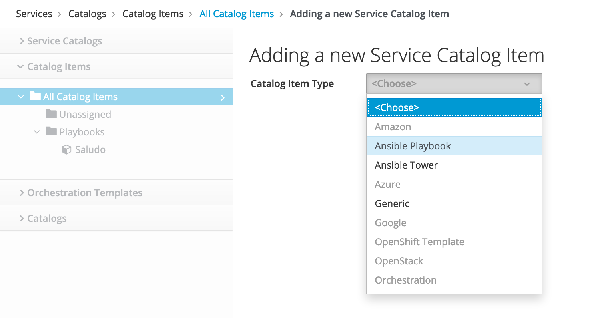

y llenar los datos que CF obtiene del proveedor de automatizacion Ansible Tower ( si esta bien configurado el proveedor se pueden visualizar el template previamente creado

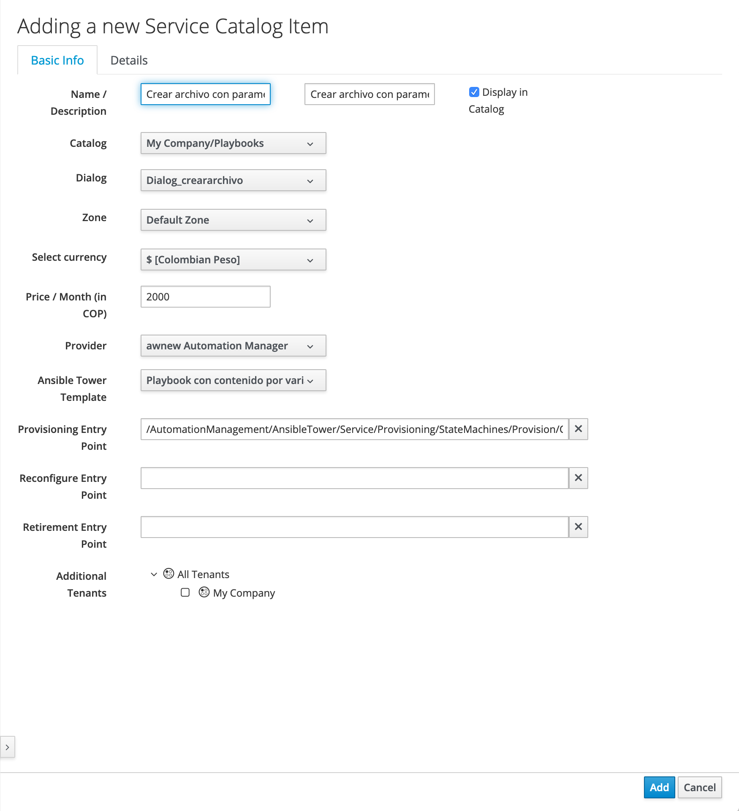

### 3. Ordenar a traves del servicio la creacion de los recursos

Es hora de realizar la prueba, en el menu -> Service -> Catalogs -> Service Catalogs -> Crear archivo con parametros -> Order


y rellenar los datos para el archivo

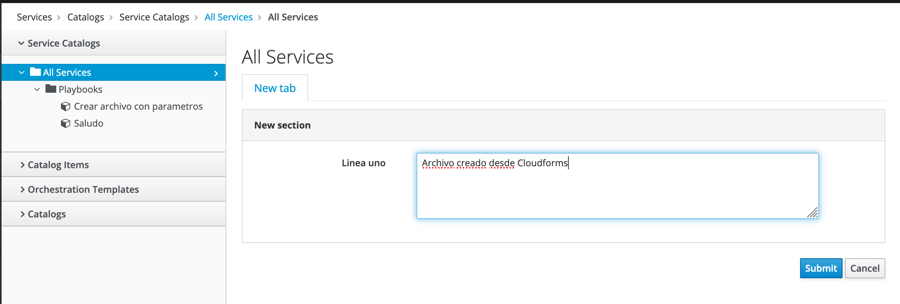

Para validar que el requerimiento se este ejecutando, se puede ingresar a Services -> Requests  y validar en que estado esta el ultimo requerimiento

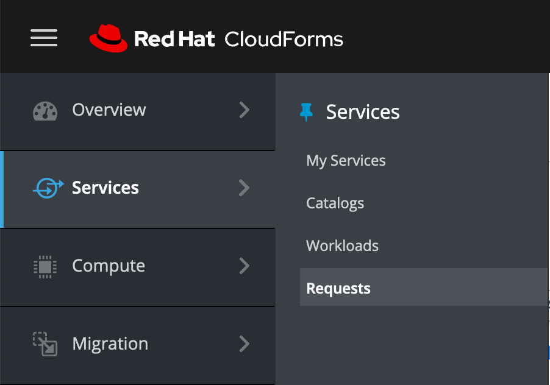

Si el requerimiento se encuentra en estado finish, los sigueinte es entrar a la maquina fisica a realizar la respectiva validacion

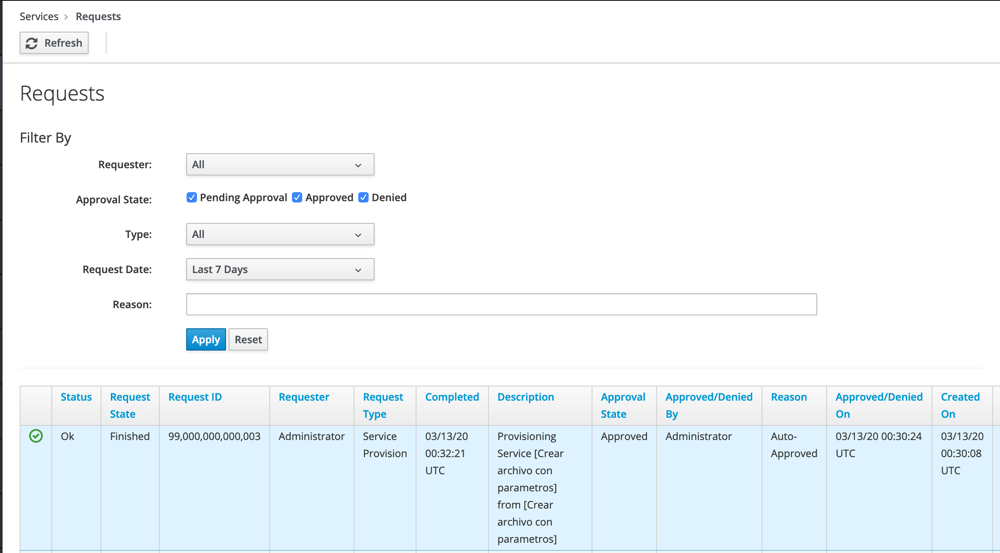


```
[root@tower36 ~]# ssh 192.168.0.14
root@192.168.0.14's password:
Last login: Thu Mar 12 20:31:18 2020 from 192.168.0.16
[root@localhost ~]# cat /tmp/jmanuel.conf
datos personalizados
Archivo creado desde Cloudforms
[root@localhost ~]#
```


